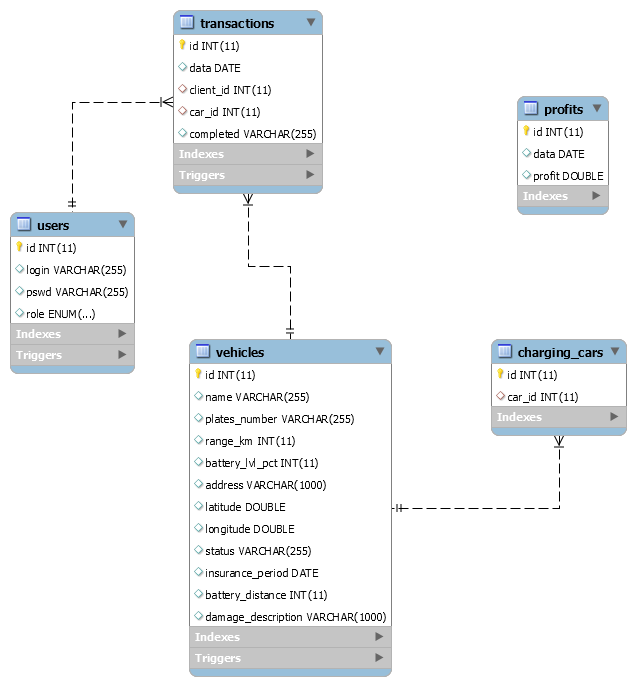

# Electric Cars Service 
Database managment app made as an assignement for academic course. It follows MVC framework and is written with Java FX and Hibernate.
It presents an electric car rental system.
>
There are two types of user - Normal and Admin (the second one has additional options to manage system).
>
It also implements service that connects with Google Maps API to show cars position in real time.

## Technologies 
Project is created with:
* Java FX version 13
* Hibernate 5
* GMapsFX version 2.12.0
* JFoenix version 9.0.9
>

>
Db EER schema:
>

**Login panel - users are saved in database**
>
 
 
>

**Main View**
> 
User can choose which car he wants to rent. It is checked if it is available. After the car is returned by user, map is automatically updated with new info.
This map is implemented by connecting with Google Maps API, so you must provide your Api Key in order for it to work.
>
 
 
>
**Admin Panel**
>
If logged user has admin credentials he can open admin panel. There he is allowed to recharge cars that were put in garage and check profit history.
>
 
